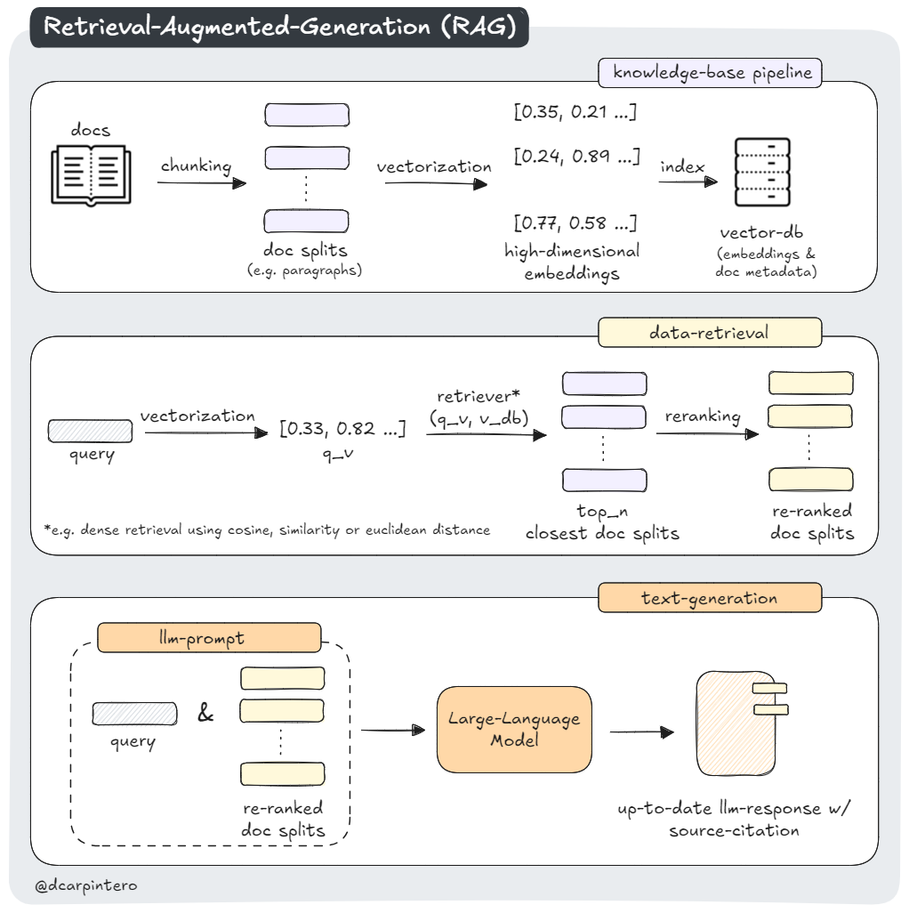

# RAG & Semantic Search in Practice

Retrieval-Augmented Generation (RAG) is a powerful approach that enhances Large Language Models (LLMs) by combining their generative capabilities with the ability to access and incorporate external knowledge during the response generation process.

Semantic Search goes beyond traditional keyword matching by understanding the meaning and intent behind search queries - it uses dense vector representations (embeddings) to capture the semantic meaning of both the query and the documents in the knowledge base, allowing it to find relevant information even when the exact keywords do not match. When integrated with RAG, Semantic Search serves as an advanced retrieval mechanism that helps the LLM find the most contextually relevant information from a custom knowledge base.

In this guide we provide practical notebooks and tips to dive into this topic:

- [rag.llamaindex.nb.ipynb](./rag.llamaindex.nb.ipynb): RAG pipeline with [LlamaIndex](https://www.llamaindex.ai/).
- [rag.langchain.nb.ipynb](./rag.langchain.nb.ipynb): RAG pipeline with [LangChain](https://python.langchain.com/docs/introduction/), illustrates chunking and hallucination.
- [rag.local.nb.ipynb](./rag.local.nb.ipynb): RAG pipeline with a local quantized model.



## Data Ingestion 

The first step when implementing a RAG system with Semantic Search is to prepare a knowledge base. This involves collecting and preprocessing documents such as web pages, PDFs, internal docs, or any text-based information.

## Vectorization into High-Dimensional Embeddings

### Understanding Embeddings

Embeddings represent data (such as text) as numerical vectors in a high-dimensional space, typically using 512, 768, or 1024 dimensions. These dense vectors capture the semantic meaning and relationships between different pieces of data, enabling more nuanced and context-aware matching and retrieval. Think of them as sophisticated mathematical fingerprints that preserve the essence and meaning of the original text.

### Document Chunking

In practice, documents are first divided into smaller, meaningful chunks before converting them into vectors. This chunking process represents a critical design decision in RAG-based applications, as it requires careful balancing of context and specificity. If chunks are too large, the embeddings might become too general; if they're too small, they might lose the contextual relationships that give text its deeper meaning.

### Chunking Strategies and Metadata Enhancement

The optimal chunking strategy depends heavily on the nature of the texts and the types of queries a system needs to handle. Common approaches include dividing text at natural boundaries like sentences or paragraphs, often with overlapping segments to preserve context across chunk boundaries. Many implementations also enhance each chunk by incorporating document metadata, such as section titles or document headings, which provides additional context and improves retrieval accuracy. This metadata enrichment helps maintain the hierarchical structure and topical relationships present in the original document.

### Frameworks for Text Embeddings

Text embedding frameworks provide the essential tools for converting a corpus into high-dimensional vectors.

#### Sentence Transformers

[SentenceTransformers](https://huggingface.co/sentence-transformers) is a Python framework for state-of-the-art sentence, text and image embeddings.

The following example demonstrates how to generate embeddings from academic papers using SentenceTransformers. We'll use the `jinaai/jina-embeddings-v2-base-en` model to vectorize `title, abstract` pairs from an arXiv dataset with `batch_size = 64`. This batch approach allows for parallel computation on hardware accelerators like GPUs (albeit at the cost of requiring more memory): 

```python
from sentence_transformers import SentenceTransformer
model = SentenceTransformer('jinaai/jina-embeddings-v2-base-en', trust_remote_code=True)

from datasets import load_dataset
ds = load_dataset("dcarpintero/arxiv.cs.CL.25k", split="train")

corpus = [title + ':' + abstract for title, abstract in zip(ds['title'], ds['abstract'])]
f32_embeddings = model.encode(corpus,
                              batch_size=64,
                              show_progress_bar=True)
```

#### LlamaIndex

[LlamaIndex](https://docs.llamaindex.ai/en/stable/) provides a convenient abstraction layer that simplifies the complex process of document processing, chunking, and vectorization. 

Here is an example that demonstrates how to create a vector index from documents using paragraph-level chunking, defining chunks of size `1024` with an overlap of `32`:

```python
from llama_index.core import SimpleDirectoryReader
from llama_index.core import VectorStoreIndex
from llama_index.core.node_parser import SentenceSplitter

reader = SimpleDirectoryReader(input_dir="data")
docs = reader.load_data()

index = VectorStoreIndex.from_documents(
    docs,
    transformations=[SentenceSplitter(chunk_size=1024, chunk_overlap=32)],
)
```

#### LLM APIs

Many leading AI companies provide specialized embedding APIs that offer state-of-the-art performance for various use cases. 

- [OpenAI Embeddings](https://platform.openai.com/docs/guides/embeddings) such as `text-embedding-3-[small|large]`:

```python
from openai import OpenAI
client = OpenAI()

def get_embedding(text, model="text-embedding-3-small"):
   return client.embeddings.create(input = [text], model=model).data[0].embedding

df['embedding'] = df.combined.apply(lambda x: get_embedding(x, model='text-embedding-3-small'))
df.to_csv('output/embedded_data.csv', index=False)
```

- [Cohere Embeddings](https://docs.cohere.com/v2/docs/embeddings) supports multiple languages, compression and specification of the task at hand (search, classification, clustering):

```python
import cohere  
co = cohere.Client()

def get_embedding(texts, model="embed-multilingual-v3.0"):
  return co.embed(
              model=model,
              texts=texts, 
              input_type='classification',
              embedding_types=['float']) 

embeddings = get_embedding(['hello', 'ciao', 'bonjour']).embeddings.float 
```

- [Anthropic Embeddings](https://docs.anthropic.com/en/docs/build-with-claude/embeddings)

When choosing an embedding service, consider factors like: cost per token, vector dimensionality (this might have an impact on your vector database), supported languages, and compability with your LLM.

## Vector Databases

When working with embeddings in production systems, we need specialized databases designed to efficiently store, manage, and search through high-dimensional vectors. Vector databases are purpose-built systems that excel at performing similarity searches across millions or even billions of vectors with remarkable speed and efficiency. An additional advantage is that a vector database allows to add or delete vectors without having to rebuild the index. They also provide filtering capabilities and customization on search operators. 

Some popular vector database solutions are:

- [Pinecone](https://www.pinecone.io/): a fully managed vector database service that emphasizes ease of use and scalability. It is particularly known for its consistent performance at scale and ability to handle real-time updates efficiently.

- [Weaviate](https://weaviate.io/): an open-source vector database that combines vector search with structured data storage. It offers unique features like GraphQL support and the ability to create multiple vector indexes for the same data using different embedding models. This can be particularly useful when different aspects of your data require different types of semantic understanding.

- [Milvus](https://milvus.io/): another open-source solution that excels at handling massive vector datasets. It offers flexible deployment options (cloud, on-premises, or hybrid) and supports multiple indexing methods.

## Reranking

When implementing RAG systems, the initial vector similarity search often casts a wide net, retrieving a set of potentially relevant documents. However, these results might not always be ordered in a way that best serves our needs. This is where reranking comes in – a crucial step that refines and reorders the initial search results to improve the final quality of retrieved documents.

A convenient starting point to experiment with Reranking is [Cohere Rerank](https://docs.cohere.com/v2/docs/rerank-overview) endpoint, [Cohere Rerank 3.5](https://cohere.com/blog/rerank-3pt5), and the [Sentence Transformers](https://www.sbert.net/examples/applications/retrieve_rerank/README.html) framework.

## RAG Evaluation

Developments in how to evaluate RAG models are still ongoing. In practice a common approach is to evaluate on:

- Fluency: how natural, coherent, and grammatically correct are the responses. Modern systems generally achieve strong fluency ratings around 4.5/5.0.

- Perceived Utility: how helpful and informative the responses are from the user's perspective.

- Citation precision: whether citations actually support the generated statements. Calculated as the proportion of accurate citations relative to total citations used. Current commercial systems achieve around 74.5% citation precision.

- Faithfulness: whether the generated content accurately reflects the information in retrieved documents without fabrication or distortion. This metric is crucial for maintaining trust and reliability. 

- Answer relevance: how well responses align with query intent.

You might find more insights on this topic in the paper [Evaluating verifiability in generative search engines](https://arxiv.org/abs/2304.09848).

## User Interface

There are many open source alternatives that provide a ChatGPT like experience. One of the most popular ones is [Open WebUI](https://docs.openwebui.com/):


